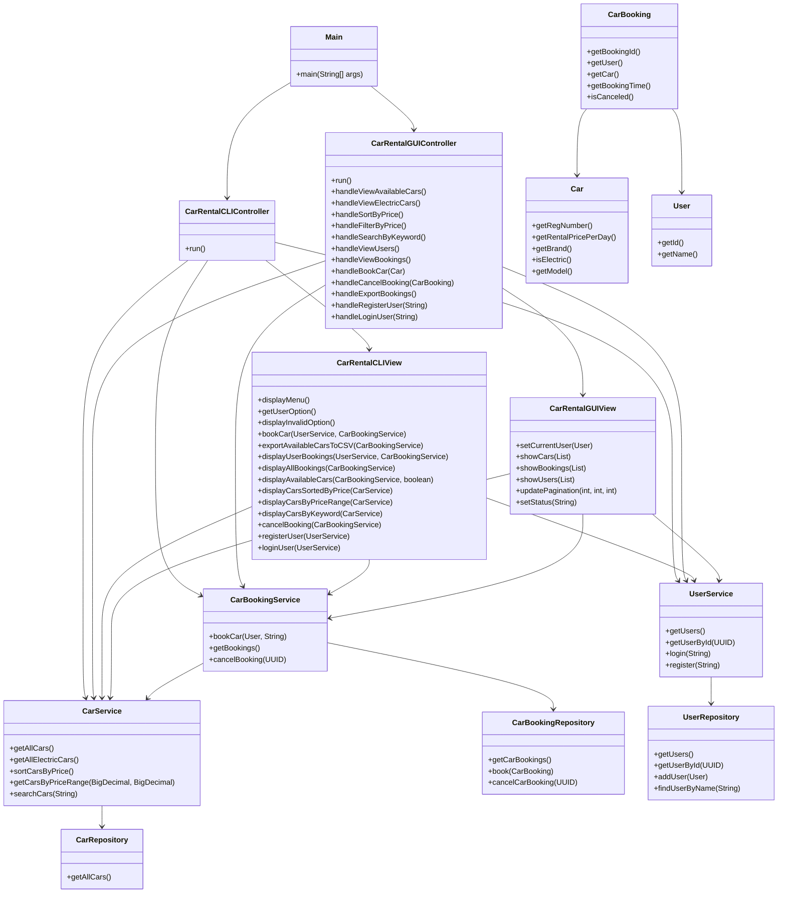

# Title

Car Rental System - MVC Structured Java Application

# Overview

This project implements a command-line car rental system using Java, designed with a clean Model-View-Controller (MVC) architecture. 

It enables users to interact with the system through a text-based menu, supporting operations such as browsing available vehicles, booking cars, viewing bookings, and managing user data. Additional features like search, filtering, and CSV exports improve usability and simulate real-world rental service operations.

The system uses structured CSV files for data persistence and offers a menu-driven, interactive experience.

This system addresses real-world needs for accessible and flexible rental options, particularly in areas with limited public transportation, providing a user-friendly rental experience via simple yet effective backend services.

# Requirements

The Car Rental System aims to provide a simple, user-friendly command-line interface that allows customers to browse available cars, book cars, and view booking information. 

All functionalities are organized under the MVC architecture to promote clear separation of concerns and future maintainability.

## Basic Features

The application must support basic car rental operations such as listing available cars, handling bookings, and displaying users and their associated bookings. 

| Feature                            | Description                                                  |
| ---------------------------------- | ------------------------------------------------------------ |
| Display Main Menu                  | Show a command-line menu for user interaction.               |
| Browse Available Cars              | List all cars currently available for rental.                |
| Browse Available Electric Cars     | List only available electric cars.                           |
| Book a Car                         | Allow a user to book a car by entering the car's registration number and their user ID. |
| View All Bookings                  | Display all bookings made in the system.                     |
| View User's Bookings               | Display all cars booked by a specific user.                  |
| View All Users                     | Display a list of all registered users.                      |
| Export Available Cars to CSV       | Allow users to export the list of available cars into a CSV file. |
| Book Car and Export Booking to CSV | After booking a car, automatically export the booking information into a CSV file named after the booking ID. |
| Exit Program                       | Allow users to gracefully exit the application.              |

## Additional Features

To enhance usability, the system additionally supports sorting cars by rental price, filtering cars by price range, searching by keywords, and exporting car and booking data into CSV files. Proper input validation and error handling are included to ensure robustness and smooth user interactions.

| Feature                        | Description                                                  |
| ------------------------------ | ------------------------------------------------------------ |
| Sort Cars by Price (Ascending) | Display available cars sorted by their rental price in ascending order. |
| Filter Cars by Price Range     | Allow users to input a minimum and maximum price and view cars within that range. |
| Search Cars by Keyword         | Allow users to search cars based on brand, registration number, or other attributes. |

# Class Design

The Car Rental System adopts a modular and layered class design, following object-oriented programming (OOP) principles and the Model-View-Controller (MVC) architectural pattern.

At a high level, the system is organized into distinct layers, each with a clear responsibility:

- **Model Layer**: Defines the core business entities (User, Car, CarBooking) and manages data operations through repositories and services.  
  Service classes (CarService, UserService, CarBookingService) encapsulate business logic and interact with data repositories to ensure a clean separation between data storage and business operations.
  
- **View Layer**: Contains the `CarRentalView` class, which handles all user interface interactions through the command-line interface (CLI).  
  It is responsible for displaying menus, capturing user input, and presenting outputs such as car listings, booking confirmations, and error messages.
  
- **Controller Layer**: The `CarRentalController` class acts as the application’s coordinator.  
  It manages the overall flow of user interaction by invoking the appropriate services and updating the view based on user actions.

## Classes & Methods

### Model Layer

The Model layer defines the core entities and business data for the Car Rental System. 

It consists of three main domains:

1. **Car Models**: Manage all information related to vehicles, including their attributes (e.g., registration number, brand, rental price, and electric status). Business logic for sorting, filtering, and searching cars is encapsulated in service classes to ensure clean separation between data and operations.

2. **User Models**: Represent users of the system. The design supports multiple data sources through a repository interface, allowing users to be retrieved either from static arrays or dynamically loaded CSV files. Service classes handle user-related operations such as listing users and finding users by ID.

3. **Booking Models**: Represent car bookings made by users. Each booking stores details like the booking ID, user, car, booking time, and cancellation status. Bookings are managed in memory with functionality to create, list, and cancel bookings, ensuring dynamic interaction between users and available cars.

The Model layer follows object-oriented principles and uses interfaces (such as `UserRepository`) to promote flexibility and extensibility. Business logic is cleanly separated into service classes (`CarService`, `UserService`, `CarBookingService`), which ensures maintainability and scalability of the system.

#### Car Models

Manage car information and provide functionality to retrieve, sort, and search cars.

| Class           | Description                                                  | Key Functions                                                |
| --------------- | ------------------------------------------------------------ | ------------------------------------------------------------ |
| `Car`           | Represents a car available for rental, with registration number, brand, daily price, and electric status. | - `getRegNumber()`, `setRegNumber()`  - `getRentalPricePerDay()`, `setRentalPricePerDay()`  - `getBrand()`, `setBrand()`  - `isElectric()`, `setElectric()` |
| `Brand`         | Enum representing different car brands (TESLA, VW, MERCEDES, AUDI). | (Enum values only)                                           |
| `CarRepository` | Provides access to a predefined static list of cars.         | - `getAllCars()`                                             |
| `CarService`    | Provides business logic for car operations such as retrieval, search, sorting, and filtering. | - `getAllCars()`  - `getCar(String regNumber)`  - `getAllElectricCars()`  - `sortCarsByPrice()`  - `getCarsByPriceRange(BigDecimal min, BigDecimal max)`  - `searchCars(String keyword)` |

#### User Models

Manage user information and provide functionality to retrieve users from different data sources.

| Class                 | Description                                                  | Key Functions                                           |
| --------------------- | ------------------------------------------------------------ | ------------------------------------------------------- |
| `User`                | Represents a user with a unique ID and name.                 | - `getId()`, `setId()`  - `getName()`, `setName()` |
| `UserRepository`      | Interface that defines methods for accessing user data.      | - `getUsers()`                                          |
| `UserArrayRepository` | Provides a static array-based implementation of `UserRepository`. | - `getUsers()`                                          |
| `UserFileRepository`  | Provides a file-based implementation of `UserRepository` that loads users from a CSV file. | - `getUsers()`                                          |
| `UserService`         | Provides business logic for accessing and searching user information. | - `getUsers()`  - `getUserById(UUID id)`           |

#### Booking Models

Manage car bookings, including booking creation, cancellation, and querying user-specific bookings.

| Class                  | Description                                                  | Key Functions                                                |
| ---------------------- | ------------------------------------------------------------ | ------------------------------------------------------------ |
| `CarBooking`           | Represents a booking made by a user for a car, including booking time and cancellation status. | - `getBookingId()`  - `getUser()`  - `getCar()`  - `getBookingTime()`  - `isCanceled()`, `setCanceled(boolean canceled)` |
| `CarBookingRepository` | Stores and manages car bookings in memory.                   | - `getCarBookings()`  - `book(CarBooking carBooking)`  - `cancelCarBooking(UUID bookingId)` |
| `CarBookingService`    | Provides business logic for booking cars, checking availability, listing bookings, and canceling bookings. | - `bookCar(User user, String regNumber)`  - `getUserBookedCars(UUID userId)`  - `getAvailableCars()`  - `getAvailableElectricCars()`  - `getBookings()`  - `cancelBooking(UUID bookingId)` |

### View Layer

The View layer in the Car Rental System is responsible for managing all user interactions through a command-line interface (CLI).

The `CarRentalView` class handles displaying menus, prompting for and reading user input, and presenting results or error messages to the user. It serves as the communication bridge between the user and the underlying system.

Key responsibilities of the View layer include:
- Displaying the main menu and available options.
- Prompting users to input selections, such as car registration numbers or user IDs.
- Displaying available cars, user bookings, all bookings, and users.
- Sorting and filtering cars based on price or keywords.
- Exporting available cars and booking details to CSV files for record-keeping.
- Providing appropriate success and error messages to guide the user.

The View layer ensures that all system outputs are user-friendly and that inputs are correctly captured for further processing by the Controller. By isolating user interaction logic, the system maintains a clean separation of concerns, making it easier to adapt the interface or extend it to other platforms (such as a GUI or web application) in the future.

| Class           | Description                                                  | Key Functions                                                |
| --------------- | ------------------------------------------------------------ | ------------------------------------------------------------ |
| `CarRentalView` | Handles all user interactions via command-line interface (CLI). Displays menus, takes input, shows available cars, bookings, users, and manages exporting data to CSV files. | - `displayMenu()`   - `bookCar(UserService, CarBookingService)`  - `exportAvailableCarsToCSV(CarBookingService)`  - `exportBookingToCSV(CarBooking)`  - `bookCarAndExport(UserService, CarBookingService)`  - `displayAllUsers(UserService)`  - `displayAvailableCars(CarBookingService, boolean)`  - `displayUserBookings(UserService, CarBookingService)`  - `displayAllBookings(CarBookingService)`  - `displayCarsSortedByPrice(CarService)`  - `displayCarsByPriceRange(CarService)`  - `displayCarsByKeyword(CarService)` |

### Controller Layer

The Controller layer in the Car Rental System is responsible for managing user interactions and coordinating between the View and Model layers.

The `CarRentalController` class acts as the main entry point of the application. It connects the user interface (CLI menu) to the underlying business logic implemented in service classes.

Key responsibilities of the controller include:

- Displaying the main menu to users.
- Reading and processing user input.
- Delegating tasks to the appropriate service layer (e.g., car booking, searching, filtering).
- Managing the overall application flow and lifecycle (start, user interactions, exit).

The `run()` method operates a loop that continuously prompts users with available actions, processes their selections, and invokes corresponding functionalities. These functionalities include booking cars, viewing user-specific and all bookings, displaying available and electric cars, sorting cars by price, filtering cars within a price range, searching cars by keyword, and listing all registered users.

By isolating user interaction management in the controller, the system maintains a clean separation of concerns, making the architecture more modular, extensible, and maintainable.

| Class                 | Description                                                  | Key Functions                                                |
| --------------------- | ------------------------------------------------------------ | ------------------------------------------------------------ |
| `CarRentalController` | Acts as the main controller connecting the View with the Service and Model layers. It handles user interactions, application flow, and delegates tasks to service classes based on user input. | - `CarRentalController(CarService carService, CarBookingService bookingService, UserService userService, CarRentalView view)` *(Constructor: Initializes the controller with service and view layers.)*   - `run()` *(Starts the main loop to display the menu, read user input, and dispatch user actions to services and views.)* |

## Relationships & UML

| Relationship                                                 | Meaning                                                      |
| ------------------------------------------------------------ | ------------------------------------------------------------ |
| `UserService → UserRepository`                               | `UserService` depends on an abstract `UserRepository` to retrieve user data. |
| `UserArrayRepository`, `UserFileRepository` implement `UserRepository` | Two implementations of user data access: static array or file-based CSV. |
| `CarService → CarRepository`                                 | `CarService` fetches car data from `CarRepository`.          |
| `CarBookingService → CarBookingRepository`, `CarService`     | `CarBookingService` manages bookings and checks car availability. |
| `CarBooking → Car`, `CarBooking → User`                      | Each booking associates a user with a car.                   |
| `CarRentalController → Services + View`                      | The controller connects user actions with business logic and view rendering. |
| `CarRentalView → Services`                                   | The view retrieves data and interacts with users based on service outputs. |

# Error Handling

In the Car Rental System, error handling is implemented to ensure robustness, user-friendliness, and system stability during unexpected events.

## User Input Validation

- Invalid Menu Option Handling: In `CarRentalView.getUserOption()`, when the user inputs something that's not an integer, a `NumberFormatException` is caught, and the method returns `-1`, prompting the system to display an "Invalid option" message without crashing the program.
- Invalid UUID Format: When users input a User ID during booking or viewing bookings, their input is parsed into a UUID. If the input is invalid or malformatted, it can throw an exception which is caught and a friendly error message is shown.
- Invalid Price Range Inputs: When filtering cars by a price range, the system catches input parsing errors (e.g., non-numeric input).

## Booking and User Validation

- Nonexistent User ID: If a user ID does not match any existing user, the system explicitly checks and shows an error message instead of proceeding.
- No Bookings or No Cars Available: If there are no bookings or no available cars, the system gracefully informs the user instead of displaying an empty list or crashing

## File Input/Output Errors

- Exporting to CSV: During file writing (both for exporting available cars and booking details), `IOException` is caught to prevent the program from crashing due to file system issues (e.g., no permission, disk full)

# Tests

# Future Improvements

While the current Car Rental System provides a fully functional command-line application for car rental operations, there are several areas for future improvement and enhancement:

- **User Interface Enhancement**: Develop a graphical user interface (GUI) using JavaFX or Swing to improve user experience beyond the command line.
- **Persistent Storage**: Replace the in-memory and CSV-based storage with a real database (e.g., MySQL, PostgreSQL) to handle larger volumes of data, enable concurrent access, and ensure data integrity.
- **User Authentication and Authorization**: Implement user login and role-based access control (e.g., Admin vs. Customer) to secure sensitive operations such as managing bookings or cars.
- **Booking Management Enhancement**: Allow users to modify existing bookings (e.g., change the rental car or dates) instead of only creating and canceling bookings.
- **Real-time Availability Checking**: Add real-time car availability status updates to prevent double bookings, especially in a multi-user environment.
- **Car Return and Rental Period**: Extend the booking model to include a rental period (start date and end date) and allow users to "return" cars.

# Reflection/Retrospective

