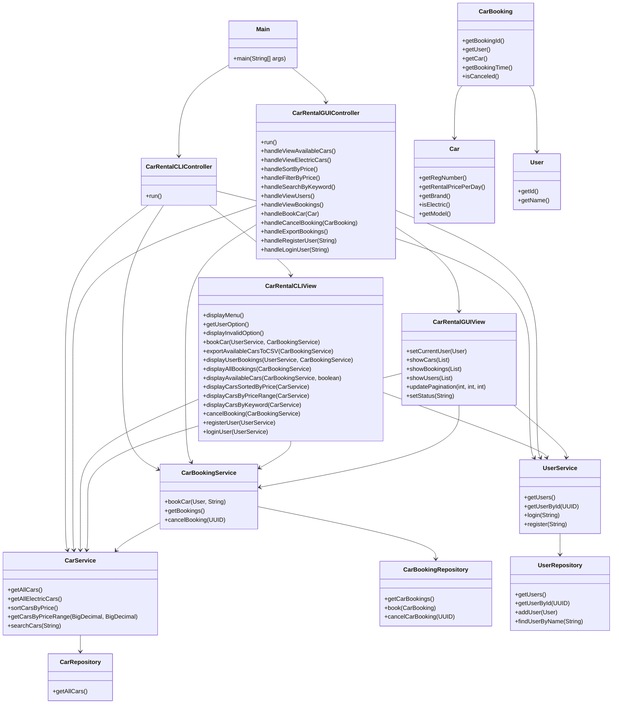

# Title

Car Rental System - MVC Structured Java Application

# Overview

This project implements a command-line car rental system using Java, designed with a clean Model-View-Controller (MVC) architecture. 

It enables users to interact with the system through a text-based menu, supporting operations such as browsing available vehicles, booking cars, viewing bookings, and managing user data. Additional features like search, filtering, and CSV exports improve usability and simulate real-world rental service operations.

The system uses structured CSV files for data persistence and offers a menu-driven, interactive experience.

This system addresses real-world needs for accessible and flexible rental options, particularly in areas with limited public transportation, providing a user-friendly rental experience via simple yet effective backend services.

# Requirements

The Car Rental System aims to provide a simple, user-friendly command-line interface that allows customers to browse available cars, book cars, and view booking information. 

All functionalities are organized under the MVC architecture to promote clear separation of concerns and future maintainability.

## Basic Features

The application must support basic car rental operations such as listing available cars, handling bookings, and displaying users and their associated bookings. 

It also enables exporting car and booking data into CSV files. Proper input validation and error handling are included to ensure robustness and smooth user interactions.

| Feature                            | Description                                                  |
| ---------------------------------- | ------------------------------------------------------------ |
| Display Main Menu                  | Show a command-line menu for user interaction.               |
| Browse Available Cars              | List all cars currently available for rental.                |
| Browse Available Electric Cars     | List only available electric cars.                           |
| Book a Car                         | Allow a user to book a car by entering the car's registration number and their user ID. |
| View All Bookings                  | Display all bookings made in the system.                     |
| View User's Bookings               | Display all cars booked by a specific user.                  |
| View All Users                     | Display a list of all registered users.                      |
| Export Available Cars to CSV       | Allow users to export the list of available cars into a CSV file. |
| Book Car and Export Booking to CSV | After booking a car, automatically export the booking information into a CSV file named after the booking ID. |
| Exit Program                       | Allow users to gracefully exit the application.              |

## Additional Features

To enhance usability, the system additionally supports sorting cars by rental price, filtering cars by price range, searching by keywords, providing a graphical user interface (GUI), and allowing user registration and login.

| Feature                        | Description                                                  |
| ------------------------------ | ------------------------------------------------------------ |
| Sort Cars by Price (Ascending) | Display available cars sorted by their rental price in ascending order. |
| Filter Cars by Price Range     | Allow users to input a minimum and maximum price and view cars within that range. |
| Search Cars by Keyword         | Allow users to search cars based on brand, registration number, or other attributes. |
| Graphical User Interface (GUI) | Provide a user-friendly graphical interface for easy interaction with the system. |
| User Registration & Login      | Allow users to create accounts and securely log into the system to access features. |

# Class Design

The Car Rental System adopts a modular and layered class design, following object-oriented programming (OOP) principles and the **Model-View-Controller (MVC)** architectural pattern.

At a high level, the system is organized into distinct layers, each with a clear responsibility:

- **Model Layer**: Defines the core domain entities (`User`, `Car`, `CarBooking`) and manages data through repositories and services.
  Repository classes (e.g., `UserFileRepository`, `CarFileRepository`) handle persistent storage (CSV-based), while service classes (`CarService`, `UserService`, `CarBookingService`) encapsulate business logic and provide operations such as searching, filtering, booking, and user registration.
- **View Layer**: Provides both **CLI** and **GUI** interfaces for user interaction.
  - `CarRentalCLIView` handles text-based interaction through the command-line.
  - `CarRentalGUIView` is a graphical interface built with Swing, offering modern UI components like tables, buttons, and search fields. Both views present data, collect user input, and display results and feedback.
- **Controller Layer**: Includes two controllers:
  - `CarRentalCLIController` for command-line interaction.
  - `CarRentalGUIController` for GUI event handling. These controllers coordinate between view and services, handling user actions, executing logic, and updating the interface accordingly.
     All controllers implement the shared `CarRentalControllerInterface`, allowing unified application entry.

## Classes & Methods

### Model Layer

The **Model Layer** defines the core data structures and domain logic for the Car Rental System. It is organized into three main domains—**Cars**, **Users**, and **Bookings**—with supporting utility classes that enhance modularity and code reuse.

1. **Car Models**: Manage all vehicle-related data, including registration number, brand, daily rental price, electric status, and model. Car data is loaded from a CSV file through `CarFileRepository`, which implements the `CarRepository` interface. Business logic like sorting, price filtering, and keyword-based search is provided by `CarService`.
2. **User Models**: Represent registered users, each identified by a UUID and name. The system supports pluggable user data sources via the `UserRepository` interface, with implementations including `UserArrayRepository` (in-memory) and `UserFileRepository` (CSV-based). The `UserService` handles user-related operations such as registration, login, and lookup by ID or name.
3. **Booking Models**: Represent bookings made by users. Each booking tracks the user, selected car, booking timestamp, and cancellation status. All bookings are stored in memory via `CarBookingRepository`, and managed through `CarBookingService`, which provides booking creation, cancellation, and availability logic.
4. **Utility Classes**: Located under the `student.model.utils` package, utility classes offer general-purpose logic shared across services. For example, the `CarFilterEngine` class encapsulates reusable filtering and sorting algorithms for car lists, including sorting by price, filtering by price range, and keyword-based search. This design promotes separation of concerns and keeps service classes focused and maintainable.

The Model Layer is interface-oriented and service-driven, ensuring loose coupling between data access and business rules. All core logic resides in services (`CarService`, `UserService`, `CarBookingService`), promoting high cohesion, modularity, and testability.

#### Car Models

Manage car information and provide functionality to retrieve, sort, filter, and search available cars.

| Class               | Description                                                  | Key Functions                                                |
| ------------------- | ------------------------------------------------------------ | ------------------------------------------------------------ |
| `Car`               | Represents a rental car with registration number, brand, price per day, model, and electric status. | `getRegNumber()`, `getRentalPricePerDay()`, `getBrand()`, `isElectric()`, `getModel()` |
| `Brand`             | Enum representing various car brands (TESLA, AUDI, MERCEDES, etc.). | Enum constants                                               |
| `CarRepository`     | Interface for accessing car data.                            | `getAllCars()`                                               |
| `CarFileRepository` | Loads car data from a CSV file (`data/cars.csv`) and implements `CarRepository`. | `getAllCars()`                                               |
| `CarService`        | Provides business logic for retrieving, searching, sorting, and filtering cars. | `getAllCars()`, `getAllElectricCars()`, `getCar(String)`, `sortCarsByPrice()`, `getCarsByPriceRange(BigDecimal, BigDecimal)`, `searchCars(String)` |

#### User Models

Manage user information and provide functionality to retrieve users from different data sources.

| Class                 | Description                                              | Key Functions                                                |
| --------------------- | -------------------------------------------------------- | ------------------------------------------------------------ |
| `User`                | Represents a system user with a UUID and a name.         | `getId()`, `getName()`                                       |
| `UserRepository`      | Interface for accessing user data.                       | `getUsers()`, `getUserById(UUID)`, `findUserByName(String)`, `addUser(User)` |
| `UserArrayRepository` | In-memory repository implementation, useful for testing. | Same as above                                                |
| `UserFileRepository`  | CSV-backed user data storage (`data/users.csv`).         | Same as above                                                |
| `UserService`         | Handles registration, login, and lookup of users.        | `getUsers()`, `getUserById(UUID)`, `register(String)`, `login(String)` |

#### Booking Models

Manage car bookings, including booking creation, cancellation, and querying user-specific bookings.

| Class                  | Description                                                  | Key Functions                                                |
| ---------------------- | ------------------------------------------------------------ | ------------------------------------------------------------ |
| `CarBooking`           | Represents a car booking with associated user, car, time, and cancellation status. | `getBookingId()`, `getUser()`, `getCar()`, `getBookingTime()`, `isCanceled()`, `setCanceled(boolean)` |
| `CarBookingRepository` | In-memory repository for managing bookings.                  | `getCarBookings()`, `book(CarBooking)`, `cancelCarBooking(UUID)` |
| `CarBookingService`    | Provides booking logic including availability check, booking, listing, and cancellation. | `bookCar(User, String)`, `getAvailableCars()`, `getAvailableElectricCars()`, `getUserBookedCars(UUID)`, `getBookings()`, `cancelBooking(UUID)` |

#### Utility Classes

The utility layer provides reusable helper functionality that supports the business logic in the service layer without being tied to specific data or domain models. In this system, the `CarFilterEngine` class encapsulates common filtering, sorting, and searching operations for car collections. This separation of concerns improves code clarity, encourages reuse, and keeps service classes focused on core business logic.

| Class             | Description                                                  | Key Functions                                                |
| ----------------- | ------------------------------------------------------------ | ------------------------------------------------------------ |
| `CarFilterEngine` | Utility class in `student.model.utils` that provides reusable methods for filtering and sorting cars. | `sortByPrice(List<Car>)`, `filterByPriceRange(List<Car>, min, max)`, `searchByKeyword(List<Car>, keyword)` |

### View Layer

The **View Layer** is responsible for all user-facing interactions, providing two distinct interfaces:

- A command-line interface (CLI) via `CarRentalCLIView`
- A graphical user interface (GUI) via `CarRentalGUIView`

This separation of interface from logic ensures flexibility and modularity, allowing the system to support multiple frontends while sharing the same business logic.

All views are responsible for displaying data, capturing user input, presenting error and success messages, and triggering controller actions. Views are connected to their respective controllers and communicate indirectly with services.

#### Key Responsibilities

- Displaying menus, car listings, bookings, users, and status messages.
- Capturing user input such as car registration numbers, user IDs, price ranges, and search keywords.
- Supporting operations like booking cars, canceling bookings, filtering/sorting/searching cars.
- Providing feedback through success/error dialogs or console messages.
- Exporting car and booking data to CSV files for persistence.
- Enabling user login and registration in both CLI and GUI modes.
- GUI view provides pagination, button-based interaction, and visual components for enhanced user experience.

| Class                    | Description                                                  | Key Functions (selected)                                     |
| ------------------------ | ------------------------------------------------------------ | ------------------------------------------------------------ |
| `CarRentalCLIView`       | Text-based CLI view implementation. Interacts with users via the console using prompts and printed output. | `displayMenu()`, `getUserOption()`, `bookCar(...)`, `displayCarsSortedByPrice(...)`, `exportAvailableCarsToCSV(...)`, `registerUser(...)`, `loginUser(...)`, `cancelBooking(...)` |
| `CarRentalGUIView`       | GUI-based view using Swing. Provides a modern visual interface with buttons, tables, search box, pagination, and dialogs. | `setCurrentUser(...)`, `showCars(...)`, `showBookings(...)`, `showUsers(...)`, `updatePagination(...)`, graphical input/output dialogs for all core actions |
| `CarRentalViewInterface` | Common interface for CLI views, defining user interaction methods for all major features. | Declares methods like `bookCar(...)`, `displayAllBookings(...)`, `registerUser(...)`, etc., used by CLI controller |

### Controller Layer

The **Controller Layer** is responsible for managing user interactions and orchestrating the application flow between the View and Model layers.
 It connects user-facing actions to the system’s business logic by responding to UI events (from either CLI or GUI) and invoking the appropriate service operations.

The system provides two distinct controller implementations:

- `CarRentalCLIController` for command-line-based interaction
- `CarRentalGUIController` for graphical user interface control via buttons and events

Both controllers implement the shared `CarRentalControllerInterface`, which standardizes the launching mechanism across interface types.

#### Key Responsibilities

- Starting and managing the overall application lifecycle via `run()`
- Receiving user commands from the view layer
- Delegating operations to service classes (e.g., booking, searching, canceling)
- Updating the view based on results from the business layer
- Managing error handling and user feedback
- Supporting features like user registration/login, data export, filtering and sorting

In CLI mode, user interaction is handled via terminal prompts and input parsing. In GUI mode, interactions are event-driven (e.g., button clicks, dialogs), and results are displayed in real-time via Swing components.

| Class                          | Description                                                  | Key Functions (selected)                                     |
| ------------------------------ | ------------------------------------------------------------ | ------------------------------------------------------------ |
| `CarRentalCLIController`       | CLI-based controller that manages input/output through a text interface. It interprets user selections from the menu and performs associated logic using services. | `run()`, handles menu-driven flow like booking, listing, searching, registering, logging in |
| `CarRentalGUIController`       | GUI-based controller that reacts to button clicks, dialogs, and events. It updates the GUI view and communicates with services to handle business operations. | `handleBookCar(...)`, `handleSortByPrice()`, `handleSearchByKeyword(...)`, `handleLoginUser(...)`, `handleCancelBooking(...)`, etc. |
| `CarRentalControllerInterface` | Interface that defines the `run()` method, allowing unified controller launching regardless of interface type. | `run()`                                                      |

## Relationships & UML

The Car Rental System follows a layered, interface-driven architecture. The UML diagram below demonstrates the relationships between key components across all layers—Controller, View, and Model.

| Relationship                                                 | Description                                                  |
| ------------------------------------------------------------ | ------------------------------------------------------------ |
| `Main → CarRentalCLIController`, `Main → CarRentalGUIController` | The entry point decides to launch either CLI or GUI mode and initializes the corresponding controller. |
| `CarRentalCLIController → CarRentalCLIView`, `CarRentalGUIController → CarRentalGUIView` | Each controller connects to a specific view implementation to manage user interactions. |
| `CarRentalCLIController`, `CarRentalGUIController → CarService` | Controllers delegate car-related operations (filtering, searching, sorting) to `CarService`. |
| `CarRentalCLIController`, `CarRentalGUIController → CarBookingService` | Controllers invoke booking creation, cancellation, and lookup logic via `CarBookingService`. |
| `CarRentalCLIController`, `CarRentalGUIController → UserService` | Controllers use `UserService` for user login, registration, and retrieval. |
| `CarRentalCLIView → CarService`, `CarRentalCLIView → CarBookingService`, `CarRentalCLIView → UserService` | The CLI view directly interacts with services to perform tasks such as booking, listing cars, and managing users. |
| `CarRentalGUIView → CarService`, `CarRentalGUIView → CarBookingService`, `CarRentalGUIView → UserService` | The GUI view uses services to retrieve and display data in a visual format. |
| `CarService → CarRepository`                                 | `CarService` retrieves car data (from CSV) through the `CarRepository` interface. |
| `UserService → UserRepository`                               | `UserService` accesses and modifies user data via `UserRepository` (supports array or file-based storage). |
| `CarBookingService → CarBookingRepository`                   | `CarBookingService` stores and manages all booking records in memory. |
| `CarBookingService → CarService`                             | Booking logic depends on `CarService` to check car availability. |
| `CarBooking → User`, `CarBooking → Car`                      | Each booking is an association between a user and a car.     |
| `CarService → CarFilterEngine (implicit)`                    | Though not shown in the diagram, car sorting/filtering logic is delegated to `CarFilterEngine`, a utility class in the `utils` package. |

# Error Handling

In the Car Rental System, error handling is implemented to ensure robustness, user-friendliness, and system stability during unexpected events.

## User Input Validation

- Invalid Menu Option Handling: In `CarRentalView.getUserOption()`, when the user inputs something that's not an integer, a `NumberFormatException` is caught, and the method returns `-1`, prompting the system to display an "Invalid option" message without crashing the program.
- Invalid UUID Format: When users input a User ID during booking or viewing bookings, their input is parsed into a UUID. If the input is invalid or malformatted, it can throw an exception which is caught and a friendly error message is shown.
- Invalid Price Range Inputs: When filtering cars by a price range, the system catches input parsing errors (e.g., non-numeric input).

## Booking and User Validation

- Nonexistent User ID: If a user ID does not match any existing user, the system explicitly checks and shows an error message instead of proceeding.
- No Bookings or No Cars Available: If there are no bookings or no available cars, the system gracefully informs the user instead of displaying an empty list or crashing

## File Input/Output Errors

- Exporting to CSV: During file writing (both for exporting available cars and booking details), `IOException` is caught to prevent the program from crashing due to file system issues (e.g., no permission, disk full)

# Future Improvements

While the current Car Rental System provides a fully functional command-line application for car rental operations, there are several areas for future improvement and enhancement:

- **Persistent Storage**: Replace the in-memory and CSV-based storage with a real database (e.g., MySQL, PostgreSQL) to handle larger volumes of data, enable concurrent access, and ensure data integrity.
- **User Authentication and Authorization**: Implement user login and role-based access control (e.g., Admin vs. Customer) to secure sensitive operations such as managing bookings or cars.
- **Booking Management Enhancement**: Allow users to modify existing bookings (e.g., change the rental car or dates) instead of only creating and canceling bookings.
- **Real-time Availability Checking**: Add real-time car availability status updates to prevent double bookings, especially in a multi-user environment.
- **Car Return and Rental Period**: Extend the booking model to include a rental period (start date and end date) and allow users to "return" cars.

