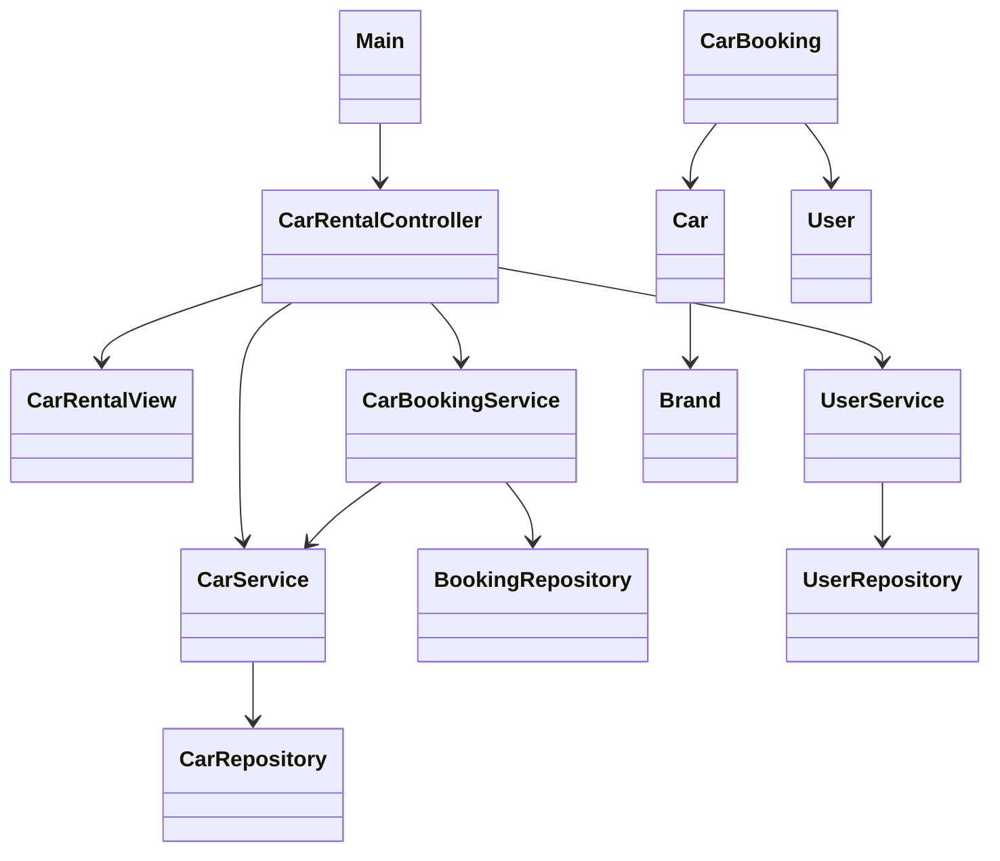

# Final Project proposal

Our group decided to create a simple car rental application because one of our members, Lucy, found it very difficult to get around Seattle. Public transportation is not very convenient, and taxis are expensive. We believe a customer-focused car rental service would be popular and help people like Lucy have more affordable and flexible travel options in Seattle.

### What are you building?
We want to create a car rental app for a rental company that serves customers. Through this app, users can freely select cars from the company’s fleet and then generate a rental order.

### What are the initial features for the application?
The basic function of this program is to let users retrieve a list of available cars from the rental company. Then, customers can pick the car they need from that list. Once a car is rented, the system will create an order linking the customer to that car.

### What are the minimum additional features you plan to implement?
1.	After launching the program, there will be a menu (in command line form) that interacts with the customer to decide what to do next.
2.	From the menu, users can access a list of cars available for rent. This list will be a CSV file sorted by vehicle ID, containing the car’s brand, price, ID, and type.
3.	After selecting a car, users can choose to export the order information in CSV format.
4.	Once a car is selected, its status changes so that no one else can rent it at the same time.
5.	A single user can rent multiple cars (one after another), but each car can only be rented by one user at a time.
6.	If users do not want to do anything else, they can exit the program.

### What are your stretch goals (features beyond the minimum)?
We think we can add some sorting and filtering features to help customers find cars that best meet their needs. In the menu, users would have more detailed filter options, such as:
1.	Sorting available cars by price in ascending order.
2.	Viewing cars within a specific price range to meet certain budgets.
3.	Entering keywords to filter cars by brand or other attributes.

### Go over your initial design.
#### Special emphasis should be placed on how you plan to break it up
#### MVC, presenter, file management, different input validation, testing, documentation, etc.

* Module Breakdown

| Module      | Role           | Responsibility Description                                                                 |
|-------------|----------------|-------------------------------------------------------------------------------------------|
| **Model**   | Entities       | - Contains data structures: `Car`, `User`, `Booking`, `Brand`                             |
| **Repository** | Data Access   | - **Repositories**: `CarRepository`, `UserRepository` - Load and persist data from files (CSV/JSON) |
| **Service** | Business Logic | - **Services**: `CarService`, `BookingService`, `UserService` - Implements sorting, filtering, and searching logic |
| **Controller** | Input Logic | - `CarRentalController` - Processes user actions and dispatches requests to services   |
| **View**    | CLI Interface  | - `CarRentalView` - Displays menu, collects user inputs, and shows results             |
| **Main**    | Entry Point    | - `Main.java` - Initializes the controller and starts the application's main loop      |

* Feature Planning & Extension

| Feature                    | Responsible Module | Description                                                           |
|----------------------------|--------------------|-----------------------------------------------------------------------|
| Sort cars by price (ascending) | `CarService`       | Use stream to sort cars                                               |
| Filter cars by price range | `CarService`       | Implement stream or method to filter cars                             |
| Keyword search by brand/attr | `CarService`       | Match keywords against car attributes (brand, registration number, etc.) |

* File Management Strategy
  * users.csv – stores user information
  * cars.csv or JSON – stores car details
* Input Validation Plan

| Validation Type      | Checkpoint            | Layer Responsible       |
|----------------------|-----------------------|-------------------------|
| **UUID format**      | User ID parsing       | `Controller`            |
| **Numeric checks**   | Price inputs, menu    | `Controller` / `View`   |
| **String validity**  | Non-empty keywords    | `Controller`            |
| **Entity existence** | Car availability      | `Service`               |

* Testing Strategy

| Layer         | Test Type           | Examples                                  |
|---------------|---------------------|-------------------------------------------|
| **Model**     | Unit Tests          | Validate `equals()`, `toString()`, constructors |
| **Service**   | Unit Tests          | Test `sortCarsByPrice()`, `filterByPriceRange()` |
| **Controller**| Integration Tests   | Simulate command flows (e.g., user input sequences) |
| **Repository**| File Handling Tests | Verify parsing of CSV/JSON files (data integrity) |

## How do you plan to break up the work?

The development work will be strictly divided into modules according to the MVC architecture, with clear responsibilities and interfaces between modules to facilitate parallel development and subsequent integration.

- Model: Responsible for defining data entities, such as Car, User, Booking, Brand.
- Repository: Handles data persistence and file reading and writing (such as CSV or JSON files).
- Service: Contains CarService, BookingService, and UserService, which are responsible for business logic (such as sorting, filtering, searching, etc.).
- Controller: CarRentalController is responsible for receiving user input, coordinating the calls of various service modules, and connecting with the view layer.
- View: Mainly implements the command line interface (CLI), which is responsible for displaying menus, collecting user input, and displaying results.
- Main: Responsible for initializing the controller and starting the entire application main loop.

### Specific division of labor

#### Lucy: Backend core module development

- [ ] Responsible for designing and implementing the model layer (Car, User, Booking, Brand)
- [ ] Write the repository layer code to implement CSV/JSON file reading and writing and data persistence
- Model: User

#### Echo: Business logic and control layer

- [ ] Develop the service layer to implement business logic such as vehicle sorting, filtering, keyword search, etc. 
- [ ] Write the control layer (CarRentalController) to process user input and coordinate various service calls
- Model: booking

#### Chichi: View layer and integration testing

- [ ] Implement the view layer (CLI interface), design menus, interaction processes
- [ ] Responsible for integration testing, debugging and document organization to ensure the smooth operation of the overall system
- Model: Car

## Teams timeline & major check-in points

### Design and task decomposition (3.27 ~ 3.31)

#### All Team Members

- Participate in project kick-off meetings to discuss system architecture and define module interfaces.
- Finalize design documents, assign tasks, and set up version control and collaboration tools.

**Check Point:**

- [ ] Complete and approve the design documentation and task breakdown.

### Core Development Phase (4.1 ~ 4.7)

#### Lucy

Develop the model layer (data entities) and complete the repository layer for file management.

**Check Point:** 

- [ ] Complete initial implementation and unit tests for data models and file operations.

#### Echo

- Build the service layer implementing sorting, filtering, and search functionalities.
- Develop the control layer to link user inputs with the service logic.

**Check Point:**

- [ ] Demonstrate a working prototype of the business logic and controller interactions.

#### Chichi

- Create the CLI for the view layer, including menu systems and user interaction flows.
- Begin drafting integration test plans and initial test cases.

**Check Point:**

- [ ] Present an early version of the CLI interface and share test plans.

### Integration & Refinement (4.8 ~ 4.10)

#### All Team Members

- Integrate the individual modules into a cohesive system.
- Conduct integration testing to ensure all components work together seamlessly.

**Check Point**:

- [ ] A fully integrated demo is completed with all core features functioning.

### Final Testing and Documentation (4.11 ~ 4.13)

#### All Team Members

- Perform comprehensive system testing, debugging, and performance optimization.
- Finalize project documentation and prepare for the demo.

**Check Point:**

- [ ] Confirm that the system is bug-free and the documentation is complete and up-to-date.

### Project Submission

- Ensure the project is finalized and all components have been thoroughly tested and documented.
- Submit the project by the deadline, with a buffer period for any final adjustments.
