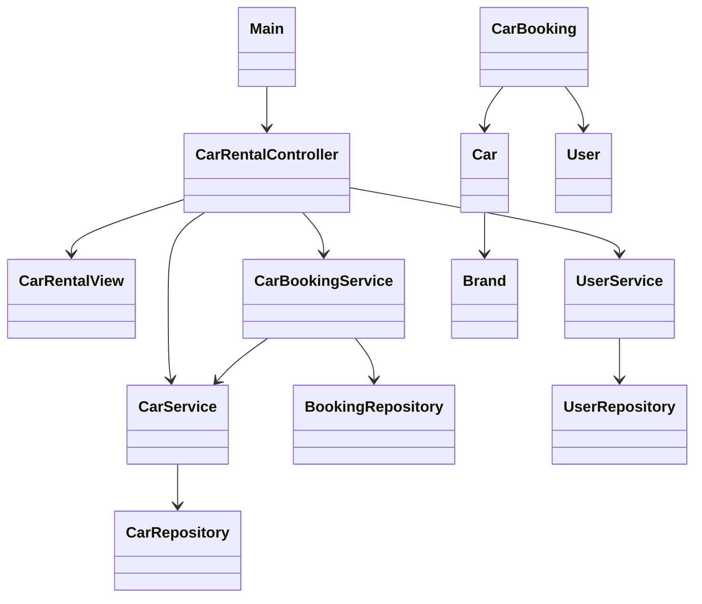

# Final Project proposal

Our group decided to create a simple car rental application because one of our members, Lucy, found it very difficult to get around Seattle. Public transportation is not very convenient, and taxis are expensive. We believe a customer-focused car rental service would be popular and help people like Lucy have more affordable and flexible travel options in Seattle.

### What are you building?
We want to create a car rental app for a rental company that serves customers. Through this app, users can freely select cars from the company’s fleet and then generate a rental order.

### What are the initial features for the application?
The basic function of this program is to let users retrieve a list of available cars from the rental company. Then, customers can pick the car they need from that list. Once a car is rented, the system will create an order linking the customer to that car.

### What are the minimum additional features you plan to implement?
1.	After launching the program, there will be a menu (in command line form) that interacts with the customer to decide what to do next.
2.	From the menu, users can access a list of cars available for rent. This list will be a CSV file sorted by vehicle ID, containing the car’s brand, price, ID, and type.
3.	After selecting a car, users can choose to export the order information in CSV format.
4.	Once a car is selected, its status changes so that no one else can rent it at the same time.
5.	A single user can rent multiple cars (one after another), but each car can only be rented by one user at a time.
6.	If users do not want to do anything else, they can exit the program.

### What are your stretch goals (features beyond the minimum)?
We think we can add some sorting and filtering features to help customers find cars that best meet their needs. In the menu, users would have more detailed filter options, such as:
1.	Sorting available cars by price in ascending order.
2.	Viewing cars within a specific price range to meet certain budgets.
3.	Entering keywords to filter cars by brand or other attributes.

### Go over your initial design.
#### Special emphasis should be placed on how you plan to break it up
#### MVC, presenter, file management, different input validation, testing, documentation, etc.

* Module Breakdown

| Module      | Role           | Responsibility Description                                                                 |
|-------------|----------------|-------------------------------------------------------------------------------------------|
| **Model**   | Entities       | - Contains data structures: `Car`, `User`, `Booking`, `Brand`                             |
| **Repository** | Data Access   | - **Repositories**: `CarRepository`, `UserRepository` - Load and persist data from files (CSV/JSON) |
| **Service** | Business Logic | - **Services**: `CarService`, `BookingService`, `UserService` - Implements sorting, filtering, and searching logic |
| **Controller** | Input Logic | - `CarRentalController` - Processes user actions and dispatches requests to services   |
| **View**    | CLI Interface  | - `CarRentalView` - Displays menu, collects user inputs, and shows results             |
| **Main**    | Entry Point    | - `Main.java` - Initializes the controller and starts the application's main loop      |

* Feature Planning & Extension

| Feature                    | Responsible Module | Description                                                           |
|----------------------------|--------------------|-----------------------------------------------------------------------|
| Sort cars by price (ascending) | `CarService`       | Use stream to sort cars                                               |
| Filter cars by price range | `CarService`       | Implement stream or method to filter cars                             |
| Keyword search by brand/attr | `CarService`       | Match keywords against car attributes (brand, registration number, etc.) |

* File Management Strategy
  * users.csv – stores user information
  * cars.csv or JSON – stores car details
* Input Validation Plan

| Validation Type      | Checkpoint            | Layer Responsible       |
|----------------------|-----------------------|-------------------------|
| **UUID format**      | User ID parsing       | `Controller`            |
| **Numeric checks**   | Price inputs, menu    | `Controller` / `View`   |
| **String validity**  | Non-empty keywords    | `Controller`            |
| **Entity existence** | Car availability      | `Service`               |

* Testing Strategy

| Layer         | Test Type           | Examples                                  |
|---------------|---------------------|-------------------------------------------|
| **Model**     | Unit Tests          | Validate `equals()`, `toString()`, constructors |
| **Service**   | Unit Tests          | Test `sortCarsByPrice()`, `filterByPriceRange()` |
| **Controller**| Integration Tests   | Simulate command flows (e.g., user input sequences) |
| **Repository**| File Handling Tests | Verify parsing of CSV/JSON files (data integrity) |
