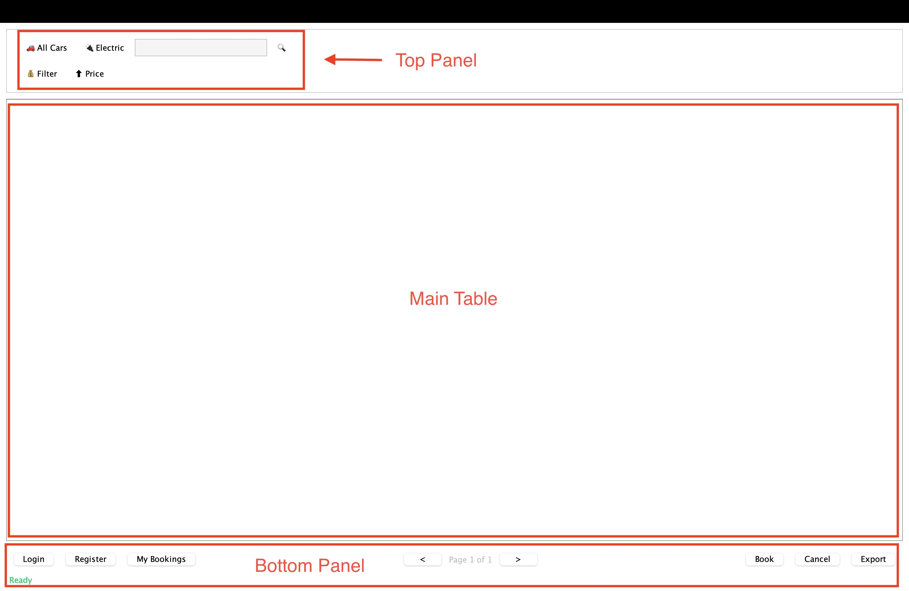

# 🚗 Car Rental System - User Manual

Welcome to the Car Rental System! This manual will walk you through how to run and use the application in both **CLI** (Command Line Interface) and **GUI** (Graphical User Interface) modes.


## Contents

1. [Introduction](#introduction)
2. [Features Overview](#features-overview)
3. [Requirements](#requirements)
4. [Running the Program](#running-the-program)
5. [Using the GUI Mode](#using-the-gui-mode)
6. [Using the CLI Mode](#using-the-cli-mode)
7. [Troubleshooting / FAQ](#troubleshooting--faq)
8. [Help](#help)


## Introduction

The **Car Rental System** is a lightweight application that allows users to browse, book, and manage rental cars through either a command-line interface (CLI) or a graphical user interface (GUI). 

It is designed with a clean and modular structure, making it easy to use and maintain. Users can choose their preferred mode of interaction and perform key rental tasks efficiently.


## Features Overview

The Car Rental System provides all the essential operations needed to manage a small-scale car rental service, including browsing available cars, booking vehicles, and viewing user or system-wide bookings. It supports both **CLI** and **GUI** modes for flexible user interaction.

Key features include:

- **Viewing Available Cars** (including electric-only options)
- **Booking and Canceling** cars by registration number and user ID
- **Listing Users and Bookings**
- **Exporting Data** to CSV files for record-keeping
- **Sorting, Filtering, and Searching** car listings
- **User Registration and Login**
- **Modern GUI Mode** using Java Swing, in addition to CLI

Robust input validation and error handling are integrated to ensure smooth and reliable user experiences.

| **Feature**                      | **CLI (Admin Console)** | **GUI (User Interface)** |
| -------------------------------- | :---------------------: | :----------------------: |
| View Available Cars              |            ✅            |            ✅             |
| View Electric Cars               |            ✅            |            ✅             |
| Sort Cars by Price               |            ✅            |            ✅             |
| Filter Cars by Price Range       |            ✅            |            ✅             |
| Search Cars by Keyword           |            ✅            |            ✅             |
| Book a Car                       |            ✅            |            ✅             |
| Cancel a Booking                 |            ✅            |            ✅             |
| User Registration & Login        |            ✅            |            ✅             |
| Export All Available Cars to CSV |            ✅            |            ✅             |
| Export Booking Info to CSV       |    ✅ *(per booking)*    | 🚫 *(only current user)*  |
| View All Users                   |    ✅  *(admin only)*    |            🚫             |
| View All Bookings in the System  |    ✅  *(admin only)*    |            🚫             |
| View Bookings by Specific User   |    ✅  *(admin only)*    | 🚫 *(only current user)*  |


## Requirements

To run the Car Rental System application, your environment must meet the following requirements:

| Requirement         | Description                                                  |
| ------------------- | ------------------------------------------------------------ |
| **Java Version**    | Java 17 or later (LTS recommended)                           |
| **JDK Required**    | Yes – required to compile the code                           |
| **Build Tool**      | You may use IntelliJ IDEA, Eclipse, or command-line tools (javac/java) |
| **CSV File Access** | Read/write access for exporting bookings and cars            |

### File Structure

Make sure your project contains the following key directories:

```
src/
 └── main/
     └── java/
         └── student/           ← source code
manual/                         ← user manual & screenshots
DesignDocuments/JavaDoc/        ← generated API docs
```


## Running the Program

You can run the Car Rental System using either the **command line** or an **IDE** (such as IntelliJ IDEA or Eclipse). Both options are explained below.


### Using Command Line

Make sure you have **Java 17 or later** installed and configured in your system PATH.

Compile the project using your IDE or via terminal:

```bash
javac -d out src/main/java/student/Main.java
```

Run the program:

```bash
java -cp out student.Main
```

When prompted:

```
Launch in CLI or GUI mode? (cli/gui):
```

Type `cli` to run in command-line mode, or `gui` to launch the Swing GUI.


### Using an IDE (IntelliJ / Eclipse)

#### IntelliJ IDEA

1. Open the project via `File > Open` and select the project root.
2. Make sure the SDK is set to Java 17+ in `File > Project Structure > SDKs`.
3. Navigate to `src/main/java/student/Main.java`.
4. Right-click on `Main.java` and select `Run 'Main.main()'`.
5. Enter `cli` or `gui` in the console when prompted.

#### Eclipse

1. Import the project: `File > Import > Existing Projects into Workspace`.
2. Open `Main.java`, then choose `Run As > Java Application`.
3. Choose CLI or GUI when prompted.


## Using the GUI Mode

The **Graphical User Interface (GUI)** provides a clean, intuitive interface for interacting with the Car Rental System. It is built using **Java Swing** and is suitable for everyday users.

Once the program launches in GUI mode, the main window will display the available actions organized into buttons and tables.


### Initial GUI interface



The GUI mode provides a modern interface with:

#### Top Panel

- All Cars / Electric:
   Toggle between viewing all available cars or only electric ones.
- Search Field + Button:
   Type a keyword (e.g., brand or reg number) to filter the car list.
- Filter / Price:
  - Filter opens a dialog to enter minimum and maximum price.
  - Price sorts all displayed cars in ascending order by daily rental price.

#### Main Table

- This area displays:
  - Available cars (with brand, model, price, and type)
  - Bookings (with user, car, time, and status)
- The table updates based on your selection or action.

#### Bottom Panel

- Login / Register / My Bookings:
  - Login to your account, register as a new user, or view your personal bookings.
- Pagination Controls:
  - Navigate through pages of results using **<** and **>** buttons.
  - The current page is shown in the center.
- Book / Cancel / Export:
  - Book: Reserve a selected car (requires login).
  - Cancel: Cancel a selected booking (only your own).
  - Export: Download all bookings as a CSV file.
- Status Label (bottom-left): Displays messages like *“Ready”*, *“Logged in as...”*, or error/status updates.

All actions are performed via button clicks. You’ll see toast messages or dialogs for success/failure.


### User Registration & Login

Click Register and enter your username to register


After successful registration, a message pops up.


Registered users click Login and enter your username to log in.


After successful login, the status bar will display the user name and status.


### Browse and filter vehicles

Click All Cars / Electric to browse vehicle types.


Use Price (price sort) to sort your listing ascending by price.


Use Filter (price range) to refine your listing.


Search for vehicle keywords and get corresponding results.


### Select a car and book

After logging in, select the vehicle in the table and click Book to book. The system prompts "✅ Booking successful!"


### View record and Return a car

See booking record.


You can select an order and click Cancel to return it.


### Export booking records

Click Export to export all order records as bookings_export.csv file.

> Save path: program running directory


## Using the CLI Mode

The Command-Line Interface (CLI) is a text-based version of the Car Rental System designed for both users and administrators. It allows full access to core features using typed commands and menus.

The CLI mode runs entirely in the terminal. You'll see a menu like this:

```
===== Car Rental System =====
1. Book Car
2. View All User Booked Cars
3. View All Bookings
4. View Available Cars
5. View Available Electric Cars
6. View All Users
7. Sort Cars by Price (Ascending)
8. Filter Cars by Price Range
9. Search Cars by Keyword
10. Export Available Cars to CSV
11. Book Car and Export Booking to CSV
12. Cancel Booking
13. Register New User
14. Login User
0. Exit
==============================

Select an option: 
```

Use numbers to select options and follow the prompts.

>Compared to the GUI, which is designed for direct interaction by a single user at a time, the **CLI version serves more like an administrative console**, offering features tailored for system operators or backend administrators.
>
>In addition to standard features such as booking and searching cars, the CLI includes **exclusive administrative functions** like:
>
>- **Viewing all registered users**
>- **Listing all bookings in the system**
>- **Viewing all cars booked by a specific user**
>- **Exporting individual booking records to separate CSV files**
>
>These capabilities make the CLI mode ideal for testing, bulk reviewing, or backend control, while the GUI mode focuses on delivering a user-friendly experience for day-to-day rental operations.


### User Registration & Login

Option 13 Register User: Enter the username and the system will return the user ID.


Option 14 Login User:  After entering the username, the system verifies whether it exists.


### Book a vehicle

Option 1 Book Car


Enter the license plate number and user ID


### View & Cancel Order

Option 2: View user orders (user ID required) 


Option 3: View all orders (only supported by CLI) 


Option 12: Cancel an order (Booking ID required)


### Filter & Search Vehicles

Option 4: View all vehicles 


Option 5: View electric vehicles


Option 7: Sort by price 


Option 8: Filter by price range 


Option 9: Search by keyword


### Export CSV file

Option 10: Export all available vehicles


Option 11: Export the order information after booking


### Exit Program

Enter 0 to exit


### CLI Tips

- Type carefully when entering UUIDs (e.g. user ID or booking ID)
- Booking info can be exported to CSV files


## Troubleshooting / FAQ

Having issues? Check the following common problems and solutions:

| **Problem**                   | **Solution**                                                 |
| ----------------------------- | ------------------------------------------------------------ |
| App doesn’t start             | Ensure Java (version 17 or higher) is installed and the program is run from the root directory. |
| GUI doesn’t show cars         | Verify that the `cars.csv` file is correctly formatted and contains valid data. |
| Can’t book a car              | Make sure the car is still available and that you are logged in. |
| CSV file not created          | Check if the program has write permission in the directory and that no file conflicts exist. |
| Booking ID not found          | Double-check that the entered ID is in the correct UUID format and that the booking exists. |
| Filter/Search returns nothing | Ensure the keyword or price range is valid. Some searches may be case-sensitive. |


## Help

If you encounter issues while using the application:

- **In CLI mode**: Check the terminal for error messages and prompts.
- **In GUI mode**: Watch the status bar at the bottom of the window for feedback or warnings.

For persistent issues, restarting the program or verifying the CSV data source may help.


**Thank you for using the Car Rental System!** We hope you enjoy the experience.